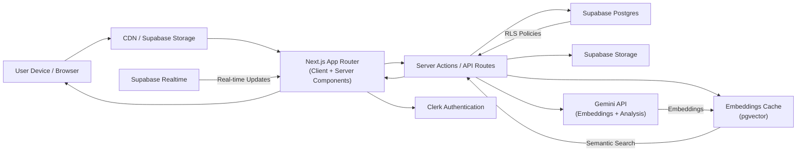

# Storey — AI-Powered Collaborative Cloud Storage

Storey is a modern, intelligent cloud storage and collaboration platform that helps teams upload, organize, search, and collaborate on files seamlessly. Built with Next.js, TypeScript, Clerk, and Supabase, Storey combines secure file storage, AI-powered semantic search, real-time collaboration, and smart file organization into a unified workspace experience.

The vision behind Storey is to move beyond traditional folder-based storage systems and create an intelligent digital workspace where files become easier to discover, manage, and understand through advanced AI capabilities and intuitive collaboration features.

## Table of Contents

- [🚀 Features](#-features)
- [🛠️ Tech Stack](#️-tech-stack)
- [📊 Architecture](#-architecture)
- [📦 Getting Started](#-getting-started)
- [📝 How to Use](#-how-to-use)
- [💬 Community](#-community)
- [Credits](#credits)

## 🚀 Features

### Core File Management

- **File Upload & Organization**: Upload and manage any type of file with drag-and-drop support
- **Hierarchical Folder System**: Create, organize, and manage files within nested folder structures
- **File Previews & Downloads**: View file previews and download files securely with signed URLs
- **File Renaming & Moving**: Reorganize files with batch operations and move files between folders
- **Storage Usage Dashboard**: Track storage consumption and monitor workspace quotas
- **File Type Categorization**: Automatic categorization and browsing by file type (documents, images, media, etc.)

### Smart Search & Discovery

- **AI-Powered Semantic Search**: Find files using natural language queries powered by embeddings
- **Keyword & Hybrid Search**: Traditional text-based search combined with semantic matching
- **Smart File Tagging**: AI-generated tags with user customization and tag-based filtering
- **Intelligent Filtering & Sorting**: Advanced search refinement and sorting options
- **Search Result Optimization**: Semantic similarity thresholds and context-aware file discovery

### Sharing & Collaboration

- **Secure File & Folder Sharing**: Share specific files or entire folder hierarchies with team members
- **Role-Based Access Control**: Granular permissions (owner, editor, viewer) for shared resources
- **Team Workspaces**: Organize teams and manage workspace-level access
- **Real-time Collaboration**: Live presence indicators and synchronized file operations
- **Activity Feeds**: Track file changes, shares, and collaborative activities
- **Workspace Member Management**: Invite, manage, and remove team members with permission control

### Data Management

- **Trash & Recycle Bin**: Soft-delete files with 30-day recovery window
- **Permanent Deletion**: Securely and permanently delete files from storage
- **Automatic Purge**: Lazy auto-purge of expired trash items
- **Storage Blob Management**: Ensure storage consistency between database and file system

### Security & Authentication

- **Secure User Authentication**: Powered by Clerk with multi-factor authentication support
- **Protected Routes & Workspace Access**: Role-based route protection and workspace isolation
- **Row Level Security (RLS)**: Database-level security enforced through Supabase RLS policies
- **Signed URLs**: Secure time-limited access for file downloads
- **Secure Data Deletion**: Sequential account deletion with cleanup of all user data across services

### Modern User Experience

- **Fully Responsive Design**: Works seamlessly on desktop, tablet, and mobile
- **Real-time UI Updates**: Instant feedback and synchronization across browser tabs
- **Beautiful File Previews**: Rich media previews with zoom and navigation support
- **Smooth Animations**: Framer Motion-powered transitions and interactions
- **Optimized Performance**: Fast load times and efficient resource utilization

## Upcoming AI Features

Storey is evolving into an increasingly intelligent storage platform with advanced AI capabilities.

### Planned AI Enhancements

- **AI-Generated Summaries**: Automatic document and media summarization
- **OCR & Text Extraction**: Extract text from PDFs and images for searchability
- **Duplicate Detection**: Smart detection and merging of duplicate files
- **Predictive Organization**: AI recommendations for file categorization and organization
- **Context-Aware Discovery**: Intelligent suggestions based on workspace usage patterns
- **Advanced Analytics**: Workspace insights, usage trends, and collaboration metrics
- **Content Understanding**: Deep file analysis for improved search and categorization

## Planned Real-time Collaboration Features

Storey is designed for collaborative team workflows with real-time synchronization.

### Collaboration Roadmap

- **Real-time Document Editing**: Collaborative editing of documents with live cursor positions
- **Live Presence Indicators**: See who's viewing or editing files in real-time
- **Collaborative Notes**: Shared note-taking within the workspace
- **Comments & Mentions**: Discuss files with inline comments and team mentions
- **File Versioning**: Complete version history with rollback capabilities
- **Change Tracking**: Detailed audit logs of all file modifications

## 🛠️ Tech Stack

### Frontend & Styling

- **React 19**
- **Next.js 16 (App Router)** with Server Components
- **TypeScript** for type safety
- **Tailwind CSS** v4 for styling
- **Framer Motion** for animations
- **ShadCN UI** for component primitives
- **Recharts** for data visualization

### Authentication & Identity

- **Clerk** for user authentication and management
- Multi-factor authentication support
- Workspace-based access control

### Backend & Database

- **Supabase Postgres** for primary data storage
- **Supabase Storage** for file storage and CDN
- **Supabase Realtime** for real-time updates
- **Supabase Row Level Security (RLS)** for data protection
- **pgvector** for embeddings and semantic search

### AI & Search

- **Google Gemini APIs** for embeddings and AI analysis
- **Semantic search** with embeddings
- **Keyword search** with full-text indexing
- **AI tagging** and categorization
- **Cosine similarity** for semantic matching

### Deployment & Infrastructure

- **Vercel** for hosting
- **Supabase** for managed database and backend
- Edge functions for serverless processing

## 📊 Architecture



## 📦 Getting Started

### Prerequisites

- **Node.js** (v18 or higher)
- **npm** or **yarn** or **pnpm**
- Git
- Accounts for: Clerk, Supabase, and Google Gemini API

### Clone the Repository

```bash
git clone https://github.com/aditya-2k23/store-it.git
cd store-it
```

### Install Dependencies

```bash
npm install
# or
yarn install
# or
pnpm install
```

### Set Up Environment Variables

Create a `.env.local` file in the root directory and add the following variables:

```bash
# Clerk Authentication
NEXT_PUBLIC_CLERK_PUBLISHABLE_KEY="your_clerk_publishable_key"
CLERK_SECRET_KEY="your_clerk_secret_key"

NEXT_PUBLIC_CLERK_SIGN_IN_URL="/sign-in"
NEXT_PUBLIC_CLERK_SIGN_UP_URL="/sign-up"
NEXT_PUBLIC_CLERK_AFTER_SIGN_IN_URL="/dashboard"
NEXT_PUBLIC_CLERK_AFTER_SIGN_UP_URL="/dashboard"

# Supabase Database & Storage
NEXT_PUBLIC_SUPABASE_URL="your_supabase_project_url"
NEXT_PUBLIC_SUPABASE_ANON_KEY="your_supabase_anon_key"
SUPABASE_SERVICE_ROLE_KEY="your_supabase_service_role_key"

# Google Gemini API (for AI features)
GEMINI_API_KEY="your_gemini_api_key"
```

### Run the Development Server

```bash
npm run dev
```

The application will be available at:

```bash
http://localhost:3000
```

### Optional: Build and Deploy

```bash
npm run build
npm start
```

## 📝 How to Use

1. **Sign Up or Log In**: Create a new account using Clerk authentication
2. **Create a Workspace**: Set up your first workspace to start organizing files
3. **Upload Files**: Use drag-and-drop or the file uploader to add files
4. **Organize with Folders**: Create folder hierarchies to structure your content
5. **Use AI Search**: Search files using natural language queries powered by embeddings
6. **Share & Collaborate**: Share files or folders with team members and set permissions
7. **Track Activity**: Monitor changes and activities through the activity feed
8. **Manage Trash**: Recover deleted files from the trash or permanently delete them

## 💬 Community

Have ideas, questions, or feedback? We'd love to hear from you!  
👉 **[Join the Discussion on GitHub](https://github.com/aditya-2k23/store-it/discussions)**

## Credits

This project was built with the help of [JavaScript Mastery](https://www.youtube.com/@javascriptmastery) YouTube channel. Check out the [video tutorial](https://www.youtube.com/watch?v=lie0cr3wESQ) to learn how to build a similar project from scratch.
